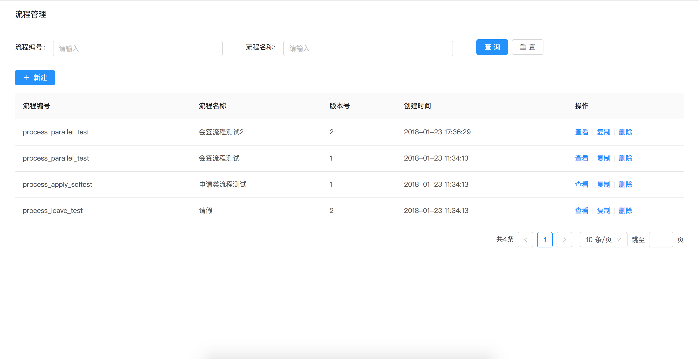
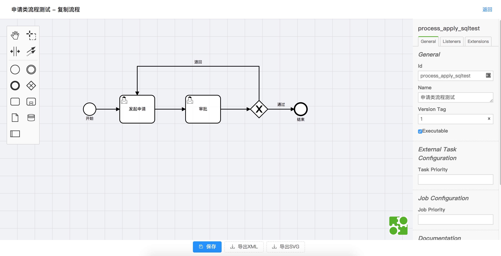

# 工作流引擎

## 工作流设计器

- [Camunda下载地址](https://camunda.com/download/modeler/)
- [文档参考](https://docs.awspaas.com/reference-guide/aws-paas-process-reference-guide/process_structure/activities.html)

## 获取项目

```bash
cd $GOPATH/src
git clone https://gitee.com/antlinker/flow.git gitee.com/antlinker/flow
cd gitee.com/antlinker/flow
go install -v ./...
```

## 使用

### 1. 初始化工作流引擎

```go
import (
	"time"

	"gitee.com/antlinker/flow"
	"gitee.com/antlinker/flow/service/db"
	_ "github.com/go-sql-driver/mysql"
)

func main() {
	flow.Init(&db.Config{
		DSN:          "root:123456@tcp(127.0.0.1:3306)/flows?charset=utf8",
		Trace:        true,
		MaxIdleConns: 100,
		MaxOpenConns: 100,
		MaxLifetime:  time.Hour * 2,
  })
}

```

### 2. 加载工作流文件

```go
	err := flow.LoadFile("leave.bpmn")
	if err != nil {
		// 处理错误
	}
```

### 3. 发起流程

```go
  input := map[string]interface{}{
	"day": 1,
  }

	result, err := flow.StartFlow("流程编号", "开始节点编号", "流程发起人ID", input)
	if err != nil {
		// 处理错误
	}
```

### 4. 查询待办流程列表

```go
	todos, err := flow.QueryTodoFlows("流程编号", "流程待办人ID")
	if err != nil {
		// 处理错误
	}
```

### 5. 处理流程

```go
  input := map[string]interface{}{
	"action": "pass",
  }

  result, err = flow.HandleFlow("待办流程节点实例ID", "流程处理人ID", input)
	if err != nil {
		// 处理错误
	}
```

### 6. 停止流程

```go
	err := flow.StopFlow("待办流程节点实例ID", func(flowInstance *schema.FlowInstance) bool {
		return flowInstance.Launcher == "XXX"
	})
	if err != nil {
		// 处理错误
	}
```

### 7. 接入WEB流程管理

```go
func main() {
serverOptions := []flow.ServerOption{
		flow.ServerStaticRootOption("./web"),
		flow.ServerPrefixOption("/flow/"),
		flow.ServerMiddlewareOption(filter),
	}

	http.Handle("/flow/", flow.StartServer(serverOptions...))
}

func filter(ctx *gear.Context) error {
	fmt.Printf("请求参数：%s - %s \n", ctx.Path, ctx.Method)
	return nil
}
```



